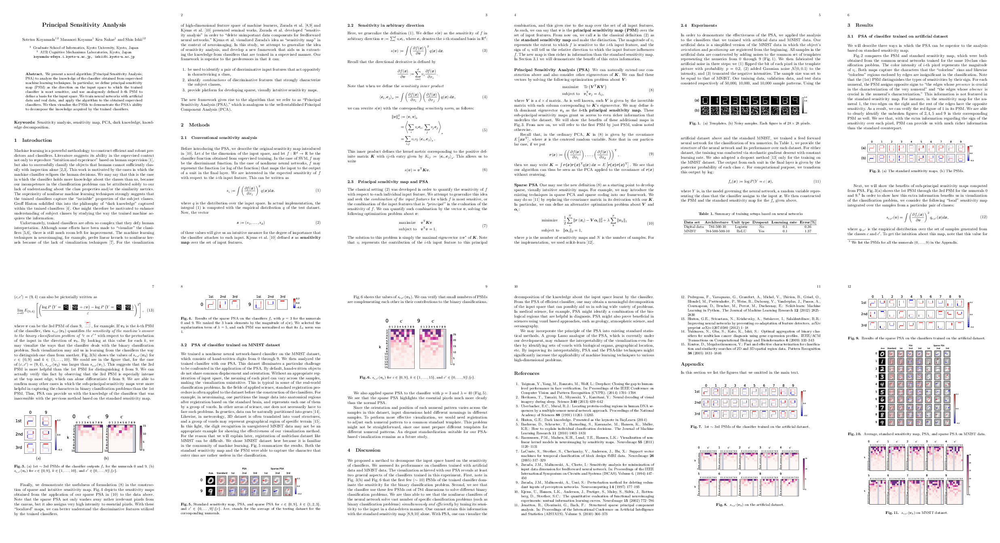
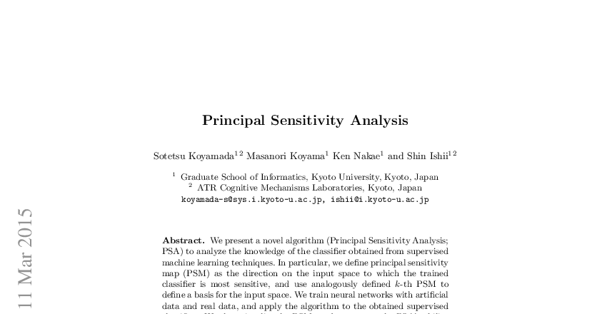

[](https://travis-ci.org/sotetsuk/paper2tmb)
[](https://github.com/sotetsuk/paper2tmb)
[](https://github.com/sotetsuk/paper2tmb)

# paper2tmb
Convert academic papers (pdf) to nice thumbnail (png)

## Example

```sh
paper2tmb stack --trim 100x60 1412.6785v2.pdf tmb.png 6 2
```




```sh
paper2tmb top --density 100 --reduce 60% 1412.6785v2.pdf tmb.png
```



The example paper is [here](http://arxiv.org/abs/1412.6785)

## Install

```sh
$ pip install paper2tmb
```

### Requirements

- ImageMagick
- docopt

### Install ImageMagick
On Mac:

```sh
$ brew install gs
$ brew install imagemagick
```

## Usage

```
Convert academic papers (pdf) to nice thumbnail (png)

Usage:
  paper2tmb stack [--trim=<trim>] [--size=<size>] <input-file> <output-file> <num-col> <num-row>
  paper2tmb top [--density=<density>] [--trim=<trim>] [--size=<size>] [--reduce=<reduce>] <input-file> <output-file>
  paper2tmb (-h | --help)
  paper2tmb --version

Options:
  <num-col>             Number of col
  <num-row>             Number of row
  --density=<density>   Resolution of image. The higher, the better (default=72)
  --size=<size>         Size of final output (e.g., 100x)
  --trim=<trim>         Trimming width and height for each page (e.g., 100x80)
  --reduce=<reduce>     Determines what % of lower region will be removed (e.g., 50%, default=50%)
  -h --help             Show this screen.
  --version             Show version.

Examples:
  paper2tmb stack --trim=100x60 --size=x400 arxiv-paper.pdf out.png
  paper2tmb top --size=x400 arxiv-paper.pdf out.png
```

## License
MIT
